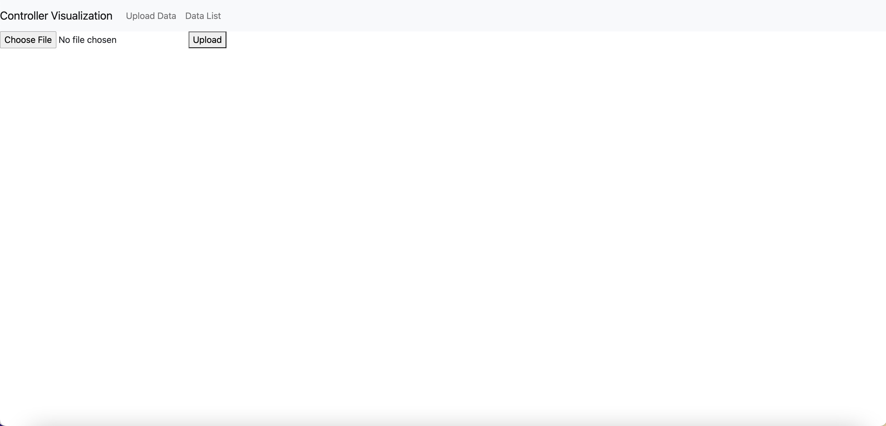
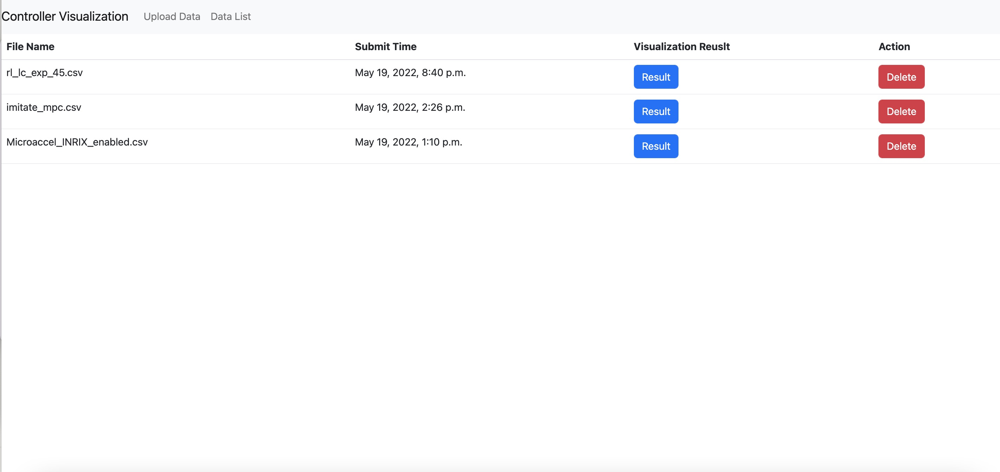
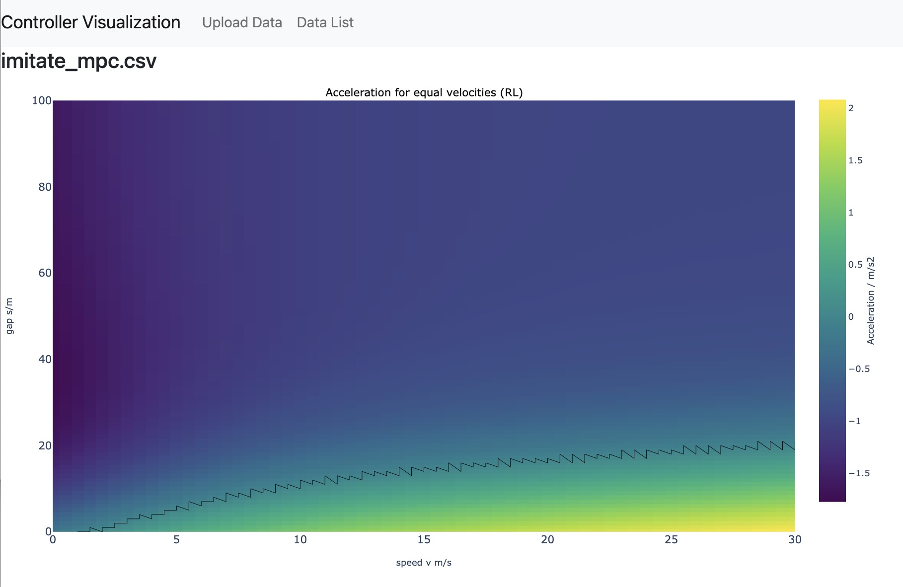
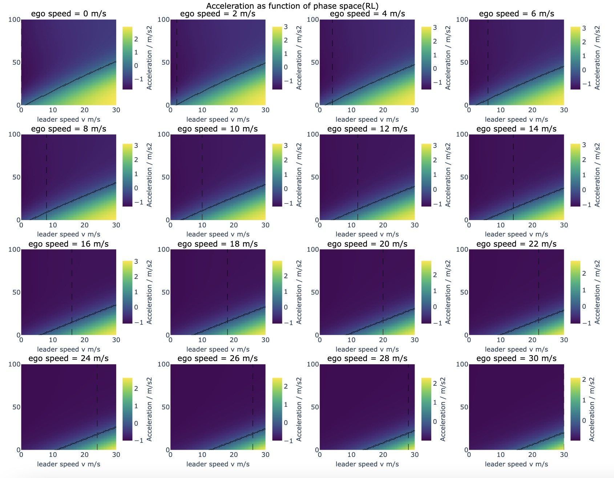
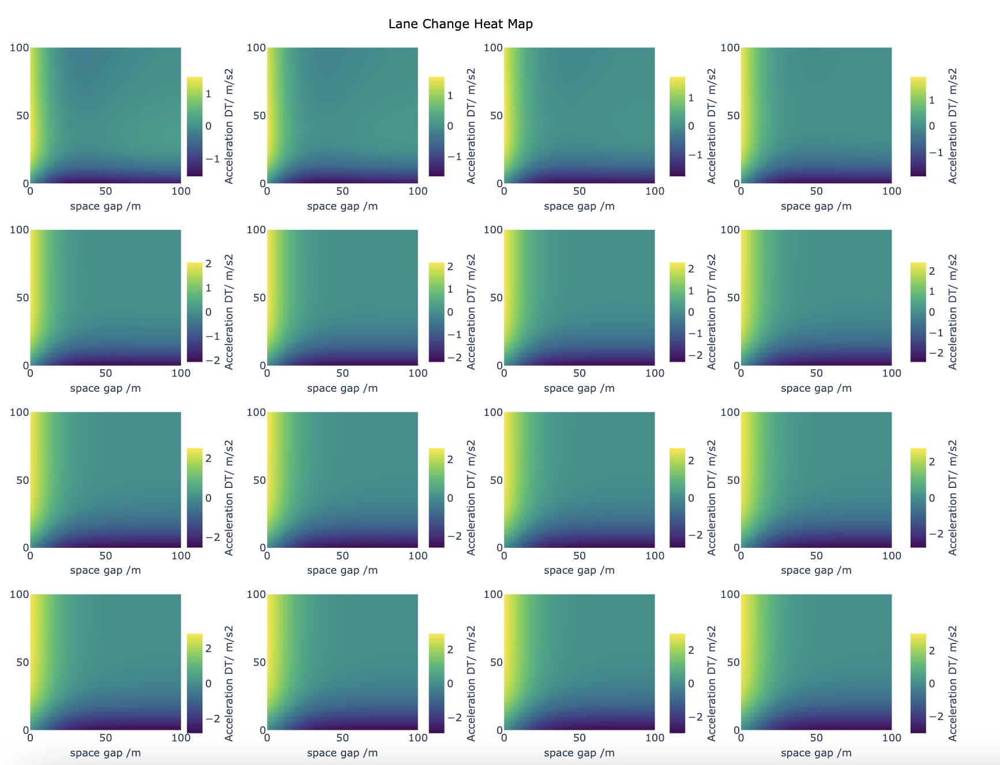

## Controller Visualization Tool

To run this application, open the terminal at the same level where manage.py locates, run the following terminal command: 
```
    python3 manage.py migrate
    python3 manage.py makemigrations
    python3 manage.py runserver
```
Visit the website at http://127.0.0.1:8000/.

Screenshot of the website:
Data Upload Page:



Data List Page:



Visualization Result Page:




